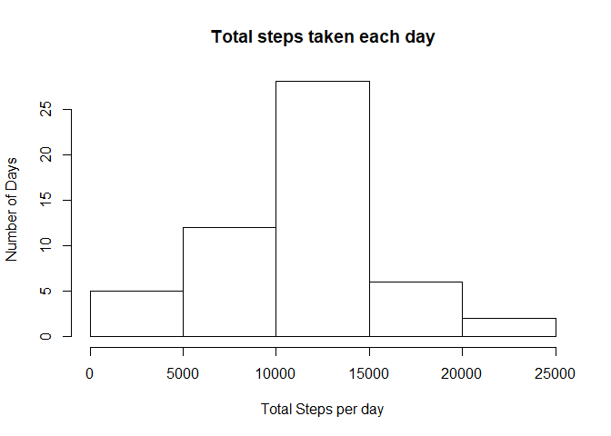
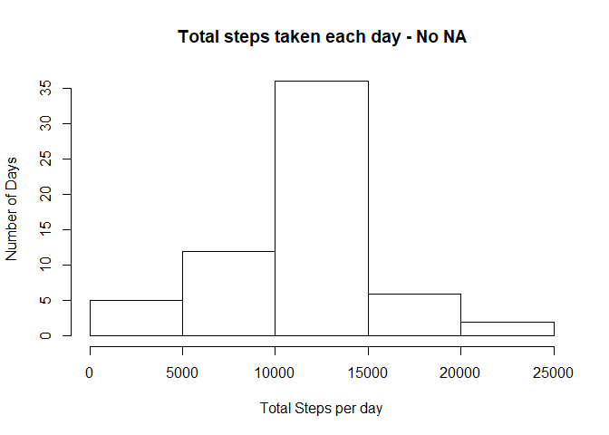
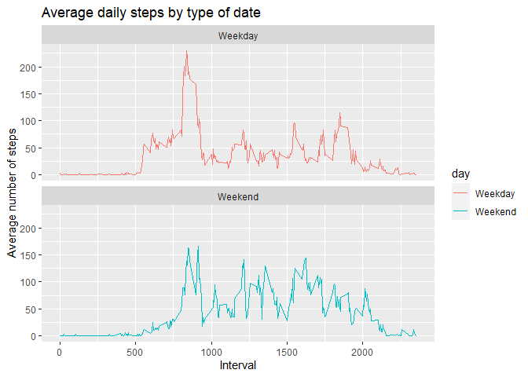

## Loading and preprocessing the data

```r
library(data.table)
unzip("./activity.zip")
data <- read.csv("./activity.csv")
data$date <- as.Date(data$date)
```
## What is mean total number of steps taken per day?

```r
TotalSteps <- tapply(data$steps,data$date,sum)
hist(TotalSteps, xlab="Total Steps per day", ylab="Number of Days", main="Total steps taken each day")
```

<!-- -->

```r
MeanSteps = mean(TotalSteps,na.rm=TRUE)
MeanSteps
```

```
## [1] 10766.19
```

```r
MedianSteps = median(TotalSteps,na.rm=TRUE)
MedianSteps
```

```
## [1] 10765
```
## What is the average daily activity pattern?

```r
AvgIntSteps <- aggregate(steps~interval, data=data, mean, na.rm=TRUE)

plot(AvgIntSteps$interval,AvgIntSteps$steps,      
        xlab = "Interval", 
        ylab = "Steps", 
        main = "Average Daily Activity Pattern", 
        type = "l")
```

<!-- -->

```r
maxInterval <- AvgIntSteps[which.max(AvgIntSteps$steps),]$interval
maxInterval
```

```
## [1] 835
```
## Imputing missing values

```r
MissingValues <- sum(is.na(data$steps))
MissingValues
```

```
## [1] 2304
```

```r
getMeanStepsPerInterval<-function(interval){
    AvgIntSteps[AvgIntSteps$interval==interval,]$steps}

DataNoNA <- data
        for (i in 1:nrow(DataNoNA)){
                if(is.na(DataNoNA[i,]$steps)){
                        DataNoNA[i,]$steps <- getMeanStepsPerInterval(DataNoNA[i,]$interval)
    }
        }

StepsNoNA <- aggregate(steps~date, data=DataNoNA, sum, na.rm=TRUE)

hist(StepsNoNA$steps,xlab="Total Steps per day", ylab="Number of Days", main="Total steps taken each day - No NA")
```

<!-- -->

```r
MeanStepsNoNA = mean(StepsNoNA$steps,na.rm=TRUE)
MeanStepsNoNA
```

```
## [1] 10766.19
```

```r
MedianStepsNoNA = median(StepsNoNA$steps,na.rm=TRUE)
MedianStepsNoNA
```

```
## [1] 10766.19
```
## Are there differences in activity patterns between weekdays and weekends?

```r
DataNoNA$day <- weekdays(DataNoNA$date)

DataNoNA$datetype <- sapply(DataNoNA$date, function(x) {
        if (weekdays(x) == "Saturday" | weekdays(x) =="Sunday") 
                {y <- "Weekend"} else 
                {y <- "Weekday"}
                y
        })


AvgDaySteps <- aggregate(DataNoNA$steps~DataNoNA$interval + DataNoNA$datetype, DataNoNA, mean, na.rm=TRUE)

names(AvgDaySteps) <- c("interval","day","steps")

library(ggplot2)

plot<- ggplot(AvgDaySteps, aes(x = interval , y = steps, color = day)) +
       geom_line() +
       labs(title = "Average daily steps by type of date", x = "Interval", y = "Average number of steps") +
    facet_wrap(~day, ncol=1,nrow=2)
   
print(plot)
```

<!-- -->
